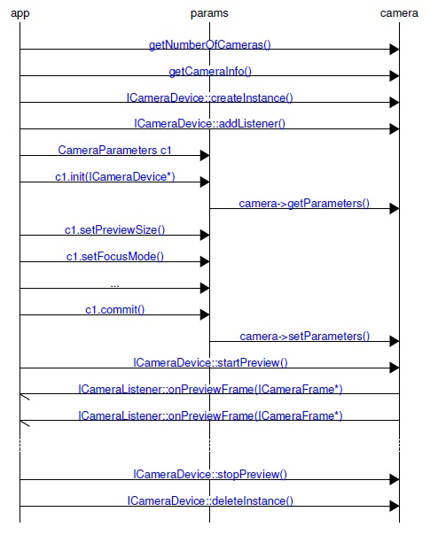

# Summary

libcamera provides C++ API to interface with camera on multiple Linux based Snapdragon platform (```APQ8074```,```APQ8096```,```APQ8009```) used in drones and robotics application.

Currently libcamera library provides APIs abstracting two different frameworks
- [Camera HAL1](https://source.android.com/devices/camera/) : ```APQ8074``` and ```APQ8009``` based platform use    this implementation.

  Note: libcamera implementation for ```APQ8009```  is present in this repository whereas implementation for 8074 is present at : https://source.codeaurora.org/quic/la/platform/hardware/qcom/camera/tree/libcamera?h=LNX.LER.1.2

- [Camera HAL3 using QMMF-SDK](https://source.android.com/devices/camera/camera3) : ```APQ8096``` based platforms use this implementation.

The core framework and API remain the same on these platforms with slight differences in functionality provided due by underlying framework differences. There are also some improvisation in APIs. This document should help in migration to different platform.

# Call Flow Sequence diagram



Application notes
==================

## Notes for porting applications from ```APQ8074``` to ```APQ8096```
- New set of API for getting per frames information such exposure time, gain, readout time, readout timestamp are added.
- On HAL1, the timestamp in frames reported in  preview and video callback  was at start of readout. In HAL3 implementation timestamp reported is start of exposure of first line of the frame.
- Currently function to camera id function mapping is not working. Hence we need to use the hardcoded camera-id for camera. Note: the camera-id is assigned based on the order in which it was initialized during boot up. Hence if one sensor is disconnected the camera-id of the sensor can change.
- Burst snapshot is enabled
- HAL3 implementation has cleaner API's to set preview frame and Snapshot formats
- On 8996, only combined stereo frames can be obtained. individual stereo frames cannot be obtained.
- The range for manualExposure and manualGain is changed.
  - For ManualExposure, on HAL1 based implementation, the function parameters values correspond to values directly written to sensor. In HAL3, the values is in unit of time (nS)
  - The min/max exposure and gain can be obtained using functions ```getManualExposureRange``` and ```getManualGainRange```.
- Acquire/Release Ref: There is a hard requirement to release all pendng frames (frames on which acquire ref is done) before calling stopPreivew or stopRecording function. Note: startPreview or startRecording also requires release ref of all pending frames.
-  The following callbacks are not yet enabled.
  - ```onControl```  : This gave information such as status of Focus operation, etc.
  - ```onMetadataFrame``` : This gave information such as bounding box for face detect, etc.
- The following feature are not yet supported or verified.
  - HDR
  - Hardware face detect
  - ZSL
  - mobicat
  - SW jpeg encoding for Snapshot
  - Manual focus. Hence snapshot eg does not contain setting focus.

 ### New APIs in HAL3 Based Implementation

 ```c++
     void setPictureFormat(const std::string& value);
     Range64 getManualExposureRange(ImageSize size, int fps);
     Range getManualGainRange(ImageSize size, int fps);
     uint64_t getFrameExposureTime(ICameraFrame* frame);
     int32_t getFrameGainValue(ICameraFrame* frame);
     uint64_t getFrameRollingShutterSkew(ICameraFrame* frame);
     uint64_t getFrameReadoutTimestamp(ICameraFrame* frame);
     uint64_t getFrameReadoutDuration(ICameraFrame* frame);
 ```

 ### Changes in existing APIs

   - ```virtual int takePicture() = 0;```  is changed to  ```virtual int takePicture(uint32_t num_images = 1) = 0;```

     Note: This does not affect application calling takePicture since it uses default value of num_images. But it will affect applications that create classes which inherits ICameraDevice.
   - ```std::vector<ImageSize> getSupportedPictureSizes() const;``` is changed to ```std::vector<ImageSize> getSupportedPictureSizes(std::string format = FORMAT_JPEG) const;```

     Note: You can query supported sizes based on image format. This was needed because in HAL3 based implementation, the supported resolution for jpeg and raw format are different for some sensors.

   - get/set sharpness APIs ```setSharpness``` now changed. User first need to set sharpness mode ```setSharpnessMode``` and then set sharpness value using ```setSharpness``` API.

   - ```setToneMapMode``` and ```setContrastTone``` must be used instead of ```setContrast``` to set contrast.

  ### API not yet implemented

 ```c++
 virtual int startAutoFocus() = 0;
 virtual void stopAutoFocus() = 0;
 ```
  ### API's not available

  ```c++
  int CameraParams::writeObject(std::ostream& ps) const;
  string CameraParams::get(const string& key) const;
  void CameraParams::set(const string& key, const string& value);
  Range CameraParams::getSupportedBrightness() const;
  int CameraParams::getBrightness() const;
  void CameraParams::setBrightness(int value);
  Range CameraParams::getSupportedContrast() const;
  int CameraParams::getContrast() const;
  void CameraParams::setContrast(int value);
  string CameraParams::toString() const;
  void CameraParams::setVerticalFlip(bool value);
  void CameraParams::setHorizontalMirror(bool value);
  void CameraParams::setStatsLoggingMask(int value);
  ```
  Only skeleton exist for the following API no implementation yet

  ```c++
  void CameraParams::setAntibanding(const string& value)
  ```


# FAQs

__How to map camera-id to function id?__

*  Each camera is given a unique function id in the sensor driver.:
  * HIRES = 0
  * LEFT SENSOR = 1
  * TRACKING SENSOR = 2
  * RIGHT SENSOR = 3
  * STEREO = 4
*  getNumberOfCameras gives information on number of camera connected on target.
*  getCameraInfo provides information on each camera loop.
*  camid is obtained by looping through available cameras and matching info.func
   with the requested camera.

__How to perform vertical flip and horizontal mirror on individual images in stereo ?__

 In stereo since the image is merged. It makes it harder to perform these operation on individual images which may be required based on  senor  orientation on target. ```setVerticalFlip``` and  ```setHorizontalMirror``` perform these operation by changing the output configuration from the sensor.

Note: only available on ```APQ8074```

__How to set FPS ?__

 Preview fps is set using the function : ```setPreviewFpsRange```. Video fps is set using the function : ```setVideoFPS```. ```setFPSindex``` scans through the supported fps values and returns index of requested fps in the array of supported fps.

__How to change the format to NV12 ?__

On Camera HAL1 based implementation, default preview stream YUV format is NV21. To change the format to NV12 use the "preview-format" key.
```
 params.set(std::string("preview-format"), std::string("nv12"));
 ```
 On HAL3 only nv12-venus is availble amoung YUV formats.

__How to enable RAW mode for tracking camera sensor ?__
* RAW stream is only available for OV7251
* RAW stream currently returns images in the preview callback.
* When configuring RAW stream, video stream on the same sensor must not be enabled. Else you will not see preview callbacks.
* When configuration RAW, these parameters must be set  in addition to other parameters for tracking camera
```c++
  * params_.set("preview-format", "bayer-rggb");
  * params_.set("picture-format", "bayer-mipi-10gbrg");
  * params_.set("raw-size", "640x480");
```


Known Limitations
=================

### ```AQP8096``` based platforms
 -  The following callbacks are not yet enabled.
   - ```onControl```  : This gave information such as status of Focus operation, etc.
   - ```onMetadataFrame``` : This gave information such as bounding box for face detect, etc.
 - The following feature are not yet supported or verified.
   - HDR
   - Hardware face detect
   - ZSL
   - mobicat
   - SW jpeg encoding for Snapshot
   - Manual focus. Hence snapshot eg does not contain setting focus.

### ```AQP8074``` based platforms
- __left/right Naming:__
  code is written with reference to schematic but for end users the left and right sensor appears swapped.
  so for user experience in the current app left option is changed to right.
  right sensor with reference to schematic always goes in stereo mode, so no left option for end users.
- Snapshot is not supported for tracking camera.
- The following parameters can be set only after starting preview :
    - ```Manual exposure```
    - ``` Manual gain```
    - ```setVerticalFlip```
    - ```setHorizontalMirror```
- Do not set the following parameters for tracking and stereo cameras
  - PictureSize
  - focus mode
  - white balance
  - ISO
  - preview format
